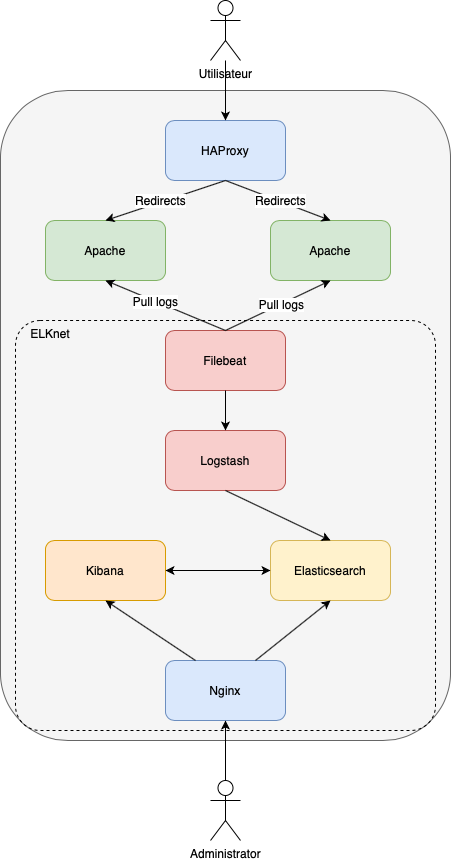

# Project of a load balanced Infrastructure with Elastic stack to monitor

- Load balanced by HAProxy
- Multiple instances of apache app
- Injection of chaos with Pumba to test reliability (Actually killing each 30s with SIGTERM)

## Getting started
To start the load balanced apache with ELK
```
git clone git@github.com:edonadei/create-scaling-webapp-with-elasticsearch.git
cd create-scaling-webapp-with-elasticsearch
docker-compose build

# Before running the stack you need to create the backup volume
docker volume create --name=backups-4-es

# Now you can run the stack
docker-compose up -d
```

- Then you can access to the application by reaching **localhost**
- Kibana is also accessible by reaching **localhost:8081**
- Elasticsearch is set up on **localhost:8081/api/es**

## Schema of infrastructure
**V1**

