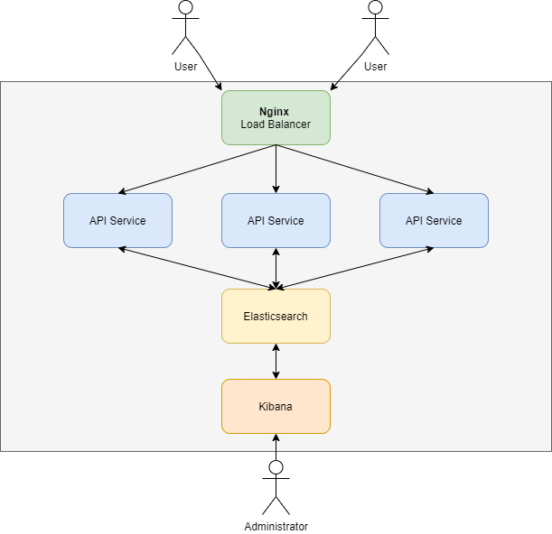

# Infrastructure

Notre projet est de réaliser une infrastructure conteneurisée permettant au client de réaliser le monitoring de son application.
Nous nous sommes appuyés sur une infrastructure simple pour commencer. Le niveau de difficulté pourra évoluer selon notre avancement et les demandes de l'enseignant.
L'idée est d'utiliser Kibana qui permet de visualiser les données pour Elasticsearch. Le schéma ci-dessus représente une première idée d'infrastructure.
Nous pourrons par la suite rajouter des conteneurs logstach et Filebeat par exemple.

Ainsi, le client pourra facilement surveiller ses applis et avoir une visibilité sur ses données. 

Notre groupe est constitué de Emrick Donadei, Camille Leou, Jérôme Coffin, Alexandre Pares.
